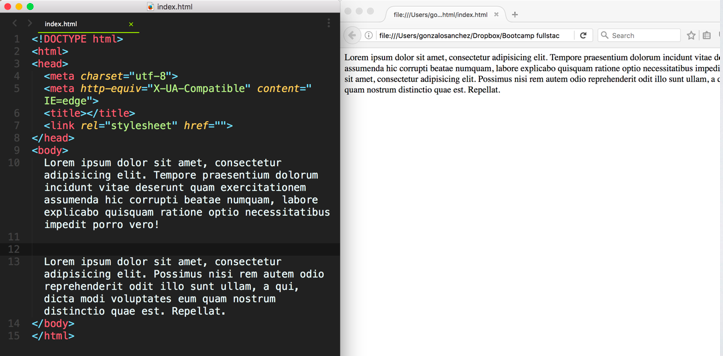

## Actividad 001 - HTML / CSS

*INSTRUCCIONES*:

- Forkea el siguiente repositorio y **corrige** los siguiente errores de código de manera local.
- Luego guarda los cambios y súbelos a un repositorio de github.
- Luego de pusheados los últimos cambios, sube el link de Github en el desafío de la sección correspondiente en la plataforma.

*Comencemos*

**1250 p:**
Además de encontrar el error , escribe el código necesario para que quede en formato de Html5.

~~~html

 hola <a> 
 </a>
~~~

**1300 p:**
Cuál es el error?

~~~html
<!DOCTYPE html>
<html>
<body>
    <title></title>
</body>
<head>

</head>
</html>
~~~

**1350 p:**
Qué le falta al siguiente código para que no se vean esos caractéres extraños en la página?

~~~html
<!DOCTYPE html>
<html>
<head>

</head>
<body>

	
 Mi nombre es Antonio Núñez López

</body>
</html>
~~~

**50 p:**
Qué le falta al siguiente código para que el título de la página (en el tab), se vea exactamente como en la imagen ?
 

~~~html
<!DOCTYPE html>
<html>
<head>
</head>
<body>

</body>
</html>
~~~

**50.2 p:**
Cuál es el error?

~~~html
<!DOCTYPE html>
<html>
<head>
	<meta charset="utf-8">
	<meta http-equiv="X-UA-Compatible" content="IE=edge">
	<title></title>
	<link rel="stylesheet" href="">
</head>
	<h1> Título 1 </h1>
<body>

</body>
</html>
~~~

**1400 p:**
Por qué no se ven los saltos de línea?

~~~html
<!DOCTYPE html>
<html>
<head>
	<meta charset="utf-8">
	<meta http-equiv="X-UA-Compatible" content="IE=edge">
	<title></title>
	<link rel="stylesheet" href="">
</head>
<body>
	Lorem ipsum dolor sit amet, consectetur adipisicing elit. Distinctio recusandae culpa, repellat ex nobis, qui. Quidem id amet, cumque, porro, et nulla provident, quis eum sequi excepturi incidunt similique voluptatum!

	Lorem ipsum dolor sit amet, consectetur adipisicing elit. Adipisci officiis ipsum rem quos. Placeat, pariatur rerum velit iste aliquid blanditiis sunt nesciunt distinctio vel, iure dolorum possimus expedita in non!
</body>
</html>
~~~

**100 p:**
Cuál es el error?

~~~html
<!DOCTYPE html>
<html>
<head>
	<meta charset="utf-8">
	<meta http-equiv="X-UA-Compatible" content="IE=edge">
	<title></title>
	<link rel="stylesheet" href="">
</head>
<body>

	
 

</body>
</html>
~~~

**200 p:**
Cuál es el error?

~~~html
<!DOCTYPE html>
<html>
<head>
	<meta charset="utf-8">
	<meta http-equiv="X-UA-Compatible" content="IE=edge">
	<title></title>
	<link rel="stylesheet" href="">
	
 hola 

</head>
<body>

</body>
</html>
~~~

**300 p:**
Cuál es el error?

~~~html
<!DOCTYPE html>
<html>
<head>
	<meta charset="utf-8">
	<meta http-equiv="X-UA-Compatible" content="IE=edge">
	<title></title>
	<link rel="stylesheet" href="">
</head>
<body>

	<a href="Soy un link"> www.google.cl </a>

</body>
</html>
~~~

**400 p:**
Cuál es el error?

~~~html
<!DOCTYPE html>
<html>
<head>
	<meta charset="utf-8">
	<meta http-equiv="X-UA-Compatible" content="IE=edge">
	<title></title>
	<link rel="stylesheet" href="">
</head>
<body>

	
 Párrafo rojo 

</body>
</html>

~~~

**500 p:**
Cuál es el error?

~~~html
<!DOCTYPE html>
<html>
<head>
	<meta charset="utf-8">
	<meta http-equiv="X-UA-Compatible" content="IE=edge">
	<title></title>
	<link rel="stylesheet" href="">
</head>
<body>

	
 Párrafo rojo 

</body>
</html>
~~~

**600 p:**
Cuál es el error?

~~~html
<!DOCTYPE html>
<html>
<head>

</head>
<body>

	<meta charset="utf-8">
	<meta http-equiv="X-UA-Compatible" content="IE=edge">
	<title></title>
	<link rel="stylesheet" href="">

</body>
</html>
~~~

**700 p:**
Cuál es el error?

~~~html
 <!DOCTYPE html>
 <html>
 <head>
 	<meta charset="utf-8">
 	<meta http-equiv="X-UA-Compatible" content="IE=edge">
 	<title></title>
 	<link rel="stylesheet" href="">
 </head>
 <body>

	 <h1> Hola </h1>
		Lorem ipsum dolor sit amet, consectetur adipisicing Tempore praesentium dolorum incidunt vitae deserunt quam exercitationem assumenda hic corrupti beatae numquam, labore explicabo quisquam ratione optio necessitatibus impedit porro vero!
	

	

		Lorem ipsum dolor sit amet, consectetur adipisicing elit. Repellat quisquam unde dicta nulla tempora! Ad, modi eveniet dicta necessitatibus aut distinctio minus tenetur hic, delectus, doloremsuscipit doloribus ab eius.
	

 </body>
 </html>
~~~

**800 p:**
Cuál es el error?:

~~~html
<!DOCTYPE html>
<html>
<head>
	<meta charset="utf-8">
	<meta http-equiv="X-UA-Compatible" content="IE=edge">
	<title></title>
	<link rel="stylesheet" href="">
</head>
<body>

	<h1> Título !! </h1>
	

		Lorem ipsum dolor sit amet, consectetur adipisicing elit. Quaerat, velit dolorem laudantium odio neque temporibus magnam praesentium unde doloremque perferendis ratione mollitia rem, consequuntur vitae soluta ex suscipit nobis optio!
	

	

	

		Lorem ipsum dolor sit amet, consectetur adipisicing elit. Placeat, dolorem praesentium quidem ex aut odit architecto, impedit, eveniet pariatur nam, sed cum qui natus. Quod consequuntur mollitia, a voluptas. Accusamus.
	

</body>
</html>
~~~

**900 p:**
Cuál es el error?

~~~html
<!DOCTYPE html>
<html>
<head>
	<meta charset="utf-8">
	<meta http-equiv="X-UA-Compatible" content="IE=edge">
	<title></title>
	<link rel="stylesheet" href="">
</head>
<body>

	
 hola <a href="#"> Link 
 </a>

</body>
</html>
~~~

**1000 p:**
Qué le falta al href para que te redirecciones al link deseado?

~~~html
<!DOCTYPE html>
<html>
<head>
	<meta charset="utf-8">
	<meta http-equiv="X-UA-Compatible" content="IE=edge">
	<title></title>
	<link rel="stylesheet" href="">
</head>
<body>

	<a href="www.desafiolatam.com">link a Desafío Latam!</a>

</body>
</html>
~~~

**1100 p:**
Si no carga la foto que está en la carpeta images , Cual es el motivo?

~~~html
<!DOCTYPE html>
<html>
<head>
	<meta charset="utf-8">
	<meta http-equiv="X-UA-Compatible" content="IE=edge">
	<title></title>
	<link rel="stylesheet" href="">
</head>
<body>

	

</body>
</html>
~~~

**1200 p:**
Cuáles son los errores?

~~~html
<!DOCTYPE html>
<html>
<head>
	<meta charset="utf-8">
	<meta http-equiv="X-UA-Compatible" content="IE=edge">
	<title></title>
	<link rel="stylesheet" href="">
</head>
<body>
	
   	<a href="http://www.google.cl"> hola </a>
	</img>
</body>
</html>
~~~

**1500 p:**
Qué le falta a mi código para que el logo sea un hipervínculo y redirija hacia http://desafiolatam.com?

~~~html
<!DOCTYPE html>
<html>
<head>
	<meta charset="utf-8">
	<meta http-equiv="X-UA-Compatible" content="IE=edge">
	<title></title>
	<link rel="stylesheet" href="">
</head>
<body>
	
</body>
</html>
~~~

**1600 p:**
Cómo se arregla el código para que sólo la palabra "Tempore" sea un link?

~~~html
<!DOCTYPE html>
<html>
<head>
	<meta charset="utf-8">
	<meta http-equiv="X-UA-Compatible" content="IE=edge">
	<title></title>
	<link rel="stylesheet" href="">
</head>
<body>
	Lorem ipsum dolor sit amet. <a href="https://www.google.cl ">
	Tempore , consectetur adipisicing elit. Iste nobis expedita placeat possimus iusto eos nisi, dolor, recusandae soluta eaque magnam quam tenetur voluptatem velit animi? Odit laboriosam nesciunt non!
</body>
</html>
~~~

**1700 p:**
Cual es el error?

~~~html
<!DOCTYPE html>
<html>
<head>
    <meta charset="utf-8">
    <title></title>
    <link rel="stylesheet" href="">
</head>
<body>
    <h1> Título !! </h1>
    
 Lorem ipsum dolor sit amet, consectetur adipisicing elit. Recusandae, libero repellendus, temporibus repellat excepturi, aperiam nostrum atque maiores fugit beatae reiciendis vitae. Quibusdam voluptatibus corporis unde, ipsam numquam, nemo assumenda.

    

    
Lorem ipsum dolor sit amet, consectetur adipisicing elit. Esse aliquam possimus rerum quidem, doloribus sed magnam quae nam neque tenetur repellat at? Voluptas fuga nulla, velit nihil facilis eum quisquam!

</body>
</html>
~~~

**1800 p:**
Corrige todos los errores (Hint: son 7)

~~~html
<!DOCTYPE html>
<html>
<head>
	<meta http-equiv="X-UA-Compatible" content="IE=edge">
	<title></title>
<body>
	<meta charset="utf-8">
	<link rel="stylesheet" href="">
	<h1> Hola </h2>

		Lorem ipsum dolor sit amet, consectetur adipisicing elit. Amet voluptate voluptas odit, sapiente soluta consectetur consequuntur ex est dolores laboriosam repudiandae unde repellat velit quo voluptatibus consequatur perferendis, tempore sunt!
	

	

	

		Lorem ipsum dolor sit amet, consectetur adipisicing elit. Iste ex, enim ipsum sequi. Dignissimos libero unde repellendus fugit quidem asperiores, veritatis aliquid vel, a eveniet praesentium labore quia dolor, accusamus?
	

</body>
</head>
<html>
~~~

**1900 p:**
Cuál es el error?

~~~html
<!DOCTYPE html>
<html>
<head>
    <link rel="stylesheet" href="">
</head>
<body>
    <"p style=color:red"> hola 

</body>
</html>
~~~
**10000 p:**
Cuál es el error?

~~~html
<!DOCTYPE html>
<html>
<head>
    <meta charset="utf-8">
</head>
<body>
    
 style="color:red" hola 

</body>
</html>
~~~

**10100 p:**
Cuál es el error?

~~~html
<!DOCTYPE html>
<html>
<head>
    <meta charset="utf-8">
</head>
<body>
    
 hola 

</body>
</html>
~~~

**10200 p:**
Cuál es el error?

~~~html
<!DOCTYPE html>
<html>
<head>
    <meta charset="utf-8">
</head>
<body>
    
 hola 

</body>
</html>
~~~

**10300 p:**
Cuál es el error (o errores)?

~~~html
<!DOCTYPE html>
<html>
<head>
    <meta charset="utf-8">
</head>
<body>
    
 hola 

    

</body>
</html>
~~~

**10400 p:**
Qué le agregarías al código para que sólo el primer párrafo sea rojo?

~~~html
<!DOCTYPE html>
<html>
<head>
    <meta charset="utf-8">
</head>
<body>
    

        
 Goooooood byeeeee !! 

        
 Holaaaa !!! 

    

</body>
</html>
~~~

**10500 p:**
Agrega estilo en el head (no inline), para que los párrafos sean de color verde 

~~~html
<!DOCTYPE html>
<html>
<head>
    <meta charset="utf-8">
</head>
<body>
    
 Hellowww 

    
 Goooooood byeeeee !! 

</body>
</html>
~~~

**10600 p:**

