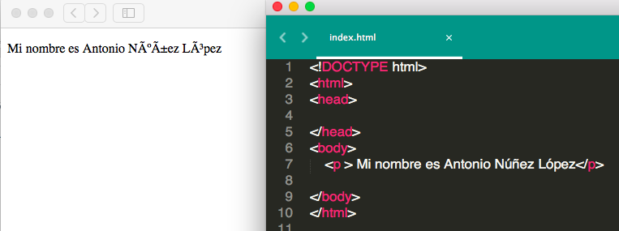
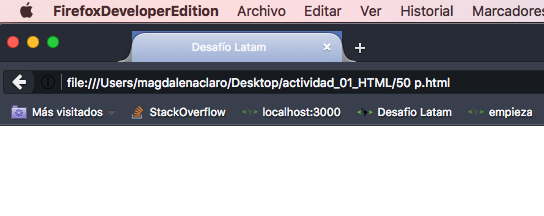
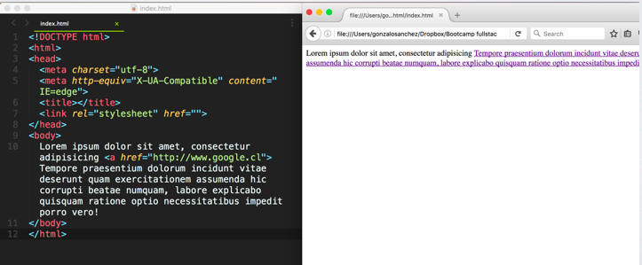

## Actividad 001 - HTML / CSS

*INSTRUCCIONES*:

- Para poder realizar este actividad debes haber realizado los cursos previos junto con haber visto los videos online correspondientes a la experiencia 1 

- Para realizar esta actividad debes realizar un **fork** de este repositorio, luego clonar el fork y **corregir** los errores de código de manera local con sublime.
- Luego guarda los cambios y súbelos a un repositorio de github.
- Luego de pusheados los últimos cambios, sube el link de Github en el desafío de la sección correspondiente en la plataforma.

*Comencemos*

##Ejercicio 1:
Además de encontrar el error de escritura de código, escribe el código necesario para que la página web quede con la estructura necesaria para HTML5

Hint: Puedes utlizar el validador de la w3c para verificar el resultado

[https://validator.w3.org/#validate\_by\_input
](https://validator.w3.org/#validate_by_input)

~~~html

  hola 
 
~~~

##Ejercicio 2:
¿Cuál es el error en el siguiente archivo HTML?

~~~html
<!DOCTYPE html>
<html>
<body>
    <title></title>
</body>
<head>

 hola ! 

</head>
</html>
~~~

##Ejercicio 3:
Qué le falta al siguiente código para que no se vean esos caractéres extraños en la página?

~~~html
<!DOCTYPE html>
<html>
<head>
</head>

<body>
	
 Mi nombre es Antonio Núñez López

</body>
</html>
~~~

##Ejercicio 4:

Qué le falta al siguiente código para que el título de la página (en el tab), se vea **exactamente** como en la imagen ?
 

~~~html
<!DOCTYPE html>
<html>
<head>
</head>
<body>

</body>
</html>
~~~

##Ejercicio 5:
¿Qué error hay en la siguiente página web?

~~~html
<!DOCTYPE html>
<html>
<head>
	<meta charset="utf-8">
	<meta http-equiv="X-UA-Compatible" content="IE=edge">
	<title></title>
	<link rel="stylesheet" href="">
</head>
	<h1> Título 1 </h1>
<body>

</body>
</html>
~~~

##Ejercicio 6:
¿Por qué no se ven los saltos de línea? 
Se pide implementar los cambios necesarios para que visualmente se pueden ver los párrafos.

~~~html
<!DOCTYPE html>
<html>
<head>
	<meta charset="utf-8">
	<meta http-equiv="X-UA-Compatible" content="IE=edge">
	<title></title>
	<link rel="stylesheet" href="">
</head>
<body>
	Lorem ipsum dolor sit amet, consectetur adipisicing elit. Distinctio recusandae culpa, repellat ex nobis, qui. Quidem id amet, cumque, porro, et nulla provident, quis eum sequi excepturi incidunt similique voluptatum!

	Lorem ipsum dolor sit amet, consectetur adipisicing elit. Adipisci officiis ipsum rem quos. Placeat, pariatur rerum velit iste aliquid blanditiis sunt nesciunt distinctio vel, iure dolorum possimus expedita in non!
</body>
</html>
~~~

##Ejercicio 7:
Encontrar el error en la siguiente página web y corregirlo.

~~~html
<!DOCTYPE html>
<html>
<head>
	<meta charset="utf-8">
	<meta http-equiv="X-UA-Compatible" content="IE=edge">
	<title></title>
	<link rel="stylesheet" href="">
</head>
<body>
	
 

</body>
</html>
~~~

##Ejercicio 8:
Encontrar el error en la siguiente página web y corregirlo.

~~~html
<!DOCTYPE html>
<html>
<head>
	<meta charset="utf-8">
	<meta http-equiv="X-UA-Compatible" content="IE=edge">
	<title></title>
	<link rel="stylesheet" href="">
	
 hola 

</head>
<body>

</body>
</html>
~~~

##Ejercicio 9:
Encontrar el error en la siguiente página web y corregirlo.

~~~html
<!DOCTYPE html>
<html>
<head>
	<meta charset="utf-8">
	<meta http-equiv="X-UA-Compatible" content="IE=edge">
	<title></title>
	<link rel="stylesheet" href="">
</head>
<body>

	<a href="Soy un link"> www.google.cl </a>

</body>
</html>
~~~

##Ejercicio 10:
Encontrar el error en la siguiente página web y corregirlo.

~~~html
<!DOCTYPE html>
<html>
<head>
	<meta charset="utf-8">
	<meta http-equiv="X-UA-Compatible" content="IE=edge">
	<title></title>
	<link rel="stylesheet" href="">
</head>
<body>

	
 Párrafo rojo 

</body>
</html>

~~~

##Ejercicio 11:
Encontrar el error en la siguiente página web y corregirlo.

~~~html
<!DOCTYPE html>
<html>
<head>
	<meta charset="utf-8">
	<meta http-equiv="X-UA-Compatible" content="IE=edge">
	<title></title>
	<link rel="stylesheet" href="">
</head>
<body>

	
 Párrafo rojo 

</body>
</html>
~~~

##Ejercicio 12:
¿Cuál es el error?

~~~html
<!DOCTYPE html>
<html>
<head>

</head>
<body>

	<meta charset="utf-8">
	<meta http-equiv="X-UA-Compatible" content="IE=edge">
	<title></title>
	<link rel="stylesheet" href="">

</body>
</html>
~~~

##Ejercicio 13:
Cuál es el error?

~~~html
 <!DOCTYPE html>
 <html>
 <head>
 	<meta charset="utf-8">
 	<meta http-equiv="X-UA-Compatible" content="IE=edge">
 	<title></title>
 	<link rel="stylesheet" href="">
 </head>
 <body>

	<h1> Hola </h1>
		Lorem ipsum dolor sit amet, consectetur adipisicing Tempore praesentium dolorum incidunt vitae deserunt quam exercitationem assumenda hic corrupti beatae numquam, labore explicabo quisquam ratione optio necessitatibus impedit porro vero!
	

	

		Lorem ipsum dolor sit amet, consectetur adipisicing elit. Repellat quisquam unde dicta nulla tempora! Ad, modi eveniet dicta necessitatibus aut distinctio minus tenetur hic, delectus, doloremsuscipit doloribus ab eius.
	

 </body>
 </html>
~~~

##Ejercicio 14:
¿Cuál es el error?:

~~~html
<!DOCTYPE html>
<html>
<head>
	<meta charset="utf-8">
	<meta http-equiv="X-UA-Compatible" content="IE=edge">
	<title></title>
	<link rel="stylesheet" href="">
</head>
<body>

	<h1> Título !! </h1>
	

		Lorem ipsum dolor sit amet, consectetur adipisicing elit. Quaerat, velit dolorem laudantium odio neque temporibus magnam praesentium unde doloremque perferendis ratione mollitia rem, consequuntur vitae soluta ex suscipit nobis optio!
	

	

	

		Lorem ipsum dolor sit amet, consectetur adipisicing elit. Placeat, dolorem praesentium quidem ex aut odit architecto, impedit, eveniet pariatur nam, sed cum qui natus. Quod consequuntur mollitia, a voluptas. Accusamus.
	

</body>
</html>
~~~

##Ejercicio 15:
¿Cuál es el error?

~~~html
<!DOCTYPE html>
<html>
<head>
	<meta charset="utf-8">
	<meta http-equiv="X-UA-Compatible" content="IE=edge">
	<title></title>
	<link rel="stylesheet" href="">
</head>
<body>

	
 hola <a href="#"> Link 
 </a>

</body>
</html>
~~~

##Ejercicio 16:
¿Qué le falta al href del link para que te redirecciones al link deseado?

~~~html
<!DOCTYPE html>
<html>
<head>
	<meta charset="utf-8">
	<meta http-equiv="X-UA-Compatible" content="IE=edge">
	<title></title>
	<link rel="stylesheet" href="">
</head>
<body>

	<a href="www.desafiolatam.com">link a Desafío Latam!</a>

</body>
</html>
~~~

##Ejercicio 17:
Hay una foto en la carpeta images, la cual no carga :cold_sweat: se pide arreglar la carga.

~~~html
<!DOCTYPE html>
<html>
<head>
	<meta charset="utf-8">
	<meta http-equiv="X-UA-Compatible" content="IE=edge">
	<title></title>
	<link rel="stylesheet" href="">
</head>
<body>

	

</body>
</html>
~~~

**12000 p:**
Cuáles son los errores?

~~~html
<!DOCTYPE html>
<html>
<head>
	<meta charset="utf-8">
	<meta http-equiv="X-UA-Compatible" content="IE=edge">
	<title></title>
	<link rel="stylesheet" href="">
</head>
<body>
	
   	<a href="http://www.google.cl"> hola </a>
	</img>
</body>
</html>
~~~

**15000 p:**
Qué le falta a mi código para que el logo sea un hipervínculo y redirija hacia http://desafiolatam.com?

~~~html
<!DOCTYPE html>
<html>
<head>
	<meta charset="utf-8">
	<meta http-equiv="X-UA-Compatible" content="IE=edge">
	<title></title>
	<link rel="stylesheet" href="">
</head>
<body>
	
</body>
</html>
~~~

**16000 p:**
Cómo se arregla el código para que sólo la palabra "Tempore" sea un link?

~~~html
<!DOCTYPE html>
<html>
<head>
	<meta charset="utf-8">
	<meta http-equiv="X-UA-Compatible" content="IE=edge">
	<title></title>
	<link rel="stylesheet" href="">
</head>
<body>
	Lorem ipsum dolor sit amet. <a href="https://www.google.cl ">
	Tempore , consectetur adipisicing elit. Iste nobis expedita placeat possimus iusto eos nisi, dolor, recusandae soluta eaque magnam quam tenetur voluptatem velit animi? Odit laboriosam nesciunt non!
</body>
</html>
~~~

**17000 p:**
Cual es el error?

~~~html
<!DOCTYPE html>
<html>
<head>
    <meta charset="utf-8">
    <title></title>
    <link rel="stylesheet" href="">
</head>
<body>
    <h1> Título !! </h1>
    
 Lorem ipsum dolor sit amet, consectetur adipisicing elit. Recusandae, libero repellendus, temporibus repellat excepturi, aperiam nostrum atque maiores fugit beatae reiciendis vitae. Quibusdam voluptatibus corporis unde, ipsam numquam, nemo assumenda.

    

    
Lorem ipsum dolor sit amet, consectetur adipisicing elit. Esse aliquam possimus rerum quidem, doloribus sed magnam quae nam neque tenetur repellat at? Voluptas fuga nulla, velit nihil facilis eum quisquam!

</body>
</html>
~~~

**18000 p:**
Corrige todos los errores (Hint: son 7)

~~~html
<!DOCTYPE html>
<html>
<head>
	<meta http-equiv="X-UA-Compatible" content="IE=edge">
	<title></title>
<body>
	<meta charset="utf-8">
	<link rel="stylesheet" href="">
	<h1> Hola </h2>

		Lorem ipsum dolor sit amet, consectetur adipisicing elit. Amet voluptate voluptas odit, sapiente soluta consectetur consequuntur ex est dolores laboriosam repudiandae unde repellat velit quo voluptatibus consequatur perferendis, tempore sunt!
	

	

	

		Lorem ipsum dolor sit amet, consectetur adipisicing elit. Iste ex, enim ipsum sequi. Dignissimos libero unde repellendus fugit quidem asperiores, veritatis aliquid vel, a eveniet praesentium labore quia dolor, accusamus?
	

</body>
</head>
<html>
~~~

**19000 p:**
Cuál es el error?

~~~html
<!DOCTYPE html>
<html>
<head>
    <link rel="stylesheet" href="">
</head>
<body>
    <"p style=color:red"> hola 

</body>
</html>
~~~
**100000 p:**
Cuál es el error?

~~~html
<!DOCTYPE html>
<html>
<head>
    <meta charset="utf-8">
</head>
<body>
    
 style="color:red" hola 

</body>
</html>
~~~

**101000 p:**
Cuál es el error?

~~~html
<!DOCTYPE html>
<html>
<head>
    <meta charset="utf-8">
</head>
<body>
    
 hola 

</body>
</html>
~~~

**102000 p:**
Cuál es el error?

~~~html
<!DOCTYPE html>
<html>
<head>
    <meta charset="utf-8">
</head>
<body>
    
 hola 

</body>
</html>
~~~

**103000 p:**
Cuál es el error (o errores)?

~~~html
<!DOCTYPE html>
<html>
<head>
    <meta charset="utf-8">
</head>
<body>
    
 hola 

    

</body>
</html>
~~~

**104000 p:**
Qué le agregarías al código para que sólo el primer párrafo sea rojo?

~~~html
<!DOCTYPE html>
<html>
<head>
    <meta charset="utf-8">
</head>
<body>
    

        
 Goooooood byeeeee !! 

        
 Holaaaa !!! 

    

</body>
</html>
~~~

**105000 p:**
Agrega estilo en el head (no inline), para que los párrafos sean de color verde 

~~~html
<!DOCTYPE html>
<html>
<head>
    <meta charset="utf-8">
</head>
<body>
    
 Hellowww 

    
 Goooooood byeeeee !! 

</body>
</html>
~~~

**106000 p:**
Cuál es el error?

~~~html
<!DOCTYPE html>
<html>
<head>
    <meta charset="utf-8">
</head>
<body>
    

        
 Goooooood byeeeee !! 

        
 Holaaaa !!! 

    

</body>
</html>
~~~

**107000 p:**
Cuál es el error?

~~~html
<!DOCTYPE html>
<html>
<head>
	<meta charset="utf-8">
	
</head>
<body>
	

		
 Hellowww 

		
 Lorem ipsum dolor sit amet. 

	

</body>
</html>
~~~

**108500 p:**
Cuál es el error?

~~~html
<!DOCTYPE html>
<html>
<head>
	<meta charset="utf-8">
</head>
<body>
	
	

		
 Hellowww 

		
 Lorem ipsum dolor sit amet. 

	

</body>
</html>
~~~

**109000 p:**
Por qué el primer párrafo se ve azúl?
Escribe en el archivo la respuesta como comentario en el código.

~~~html
<!DOCTYPE html>
<html>
<head>
	<meta charset="utf-8">
	
</head>
<body>
	

		
 Hellowww 

		
 Goooooood byeeeee !! 

	

</body>
</html>
~~~

**110000 p:**
Agrega alcódigo el css necesario para uqe todos los divs tengan color de **fondo** amarillo, y que sólo el primer párrafo tenga la letra de color blanco

~~~html
<!DOCTYPE html>
<html>
<head>
	<meta charset="utf-8">
	
</head>
<body>
	

		
 Hellowww 

	

	

		
 Lorem ipsum dolor sit amet, consectetur adipisicing elit, sed do eiusmod
		tempor incididunt ut labore et dolore magna aliqua. Ut enim ad minim veniam,
		quis nostrud exercitation ullamco laboris nisi ut aliquip ex ea commodo
		consequat. Duis aute irure dolor in reprehenderit in voluptate velit esse
		cillum dolore eu fugiat nulla pariatur. Excepteur sint occaecat cupidatat non
		proident, sunt in culpa qui officia deserunt mollit anim id est laborum.

		
 Goooooood byeeeee !! 

	

</body>
</html>
~~~ 

**111000 p:**
Agrega estilo a la imagen para que tenga tamaño de 20px.

~~~html
<!DOCTYPE html>
<html>
<head>
	<meta charset="utf-8">
	<meta http-equiv="X-UA-Compatible" content="IE=edge">
	<title></title>
	<link rel="stylesheet" href="">
</head>
<body>

	

</body>
</html>
~~~

**112000 p:**
Cuál es el error?

~~~html
<!DOCTYPE html>
<html>
<head>
	<meta charset="utf-8">
	<meta http-equiv="X-UA-Compatible" content="IE=edge">
	<title></title>
	<link rel="stylesheet" href="">
	
</head>
<body>

	

</body>
</html>
~~~

**113000 p:**
Cuales son los errores?
Y corrige para que sólo el h1 tenga la tipografía Slabo.

~~~html
<!DOCTYPE html>
<html>
<head>
	<meta charset="utf-8">
	<meta http-equiv="X-UA-Compatible" content="IE=edge">
	<title></title>
	<link rel="stylesheet" href="">
	
</head>
<body>

	
	<h1> Deafío Latam </h1>
	
 Lorem ipsum dolor sit amet, consectetur adipisicing elit. Aperiam quaerat beatae architecto possimus explicabo ex, temporibus, reprehenderit, deserunt alias excepturi quidem molestias, magnam hic asperiores sapiente animi. Ex, provident, consectetur! 

	<link href="https://fonts.googleapis.com/css?family=Slabo+27px" rel="stylesheet">
</body>
</html>
~~~

**114000 p:**
Cuál es el error?

~~~html
<!DOCTYPE html>
<html>
<head>
	<meta charset="utf-8">
	<meta http-equiv="X-UA-Compatible" content="IE=edge">
	<title></title>
	<link rel="stylesheet" href="">
</head>
<body>
	

		 
  ¿Es el fondo de color Rojo?  

	

</body>
</html>
~~~

